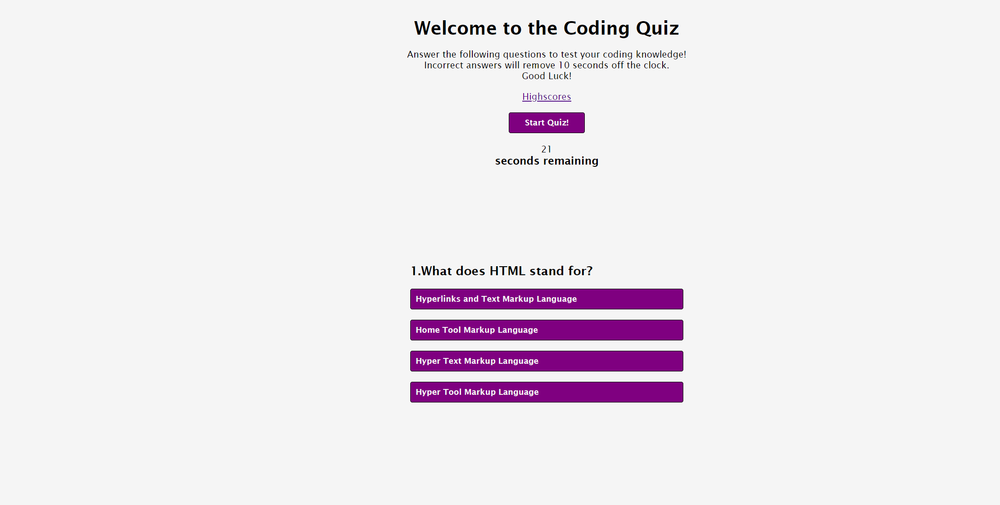

# Code-Quiz

## Description

The aim of this project was to build a coding quiz with a timer that included time penalties for incorrect answers and the ability to save the players initials on a high score list.

Through this assignment i was able to improve my understanding of HTML, CSS and Javascript. 

## Usage

The link to access the website and a screenshot of the page is below...

https://petarlo.github.io/Code-Quiz/

